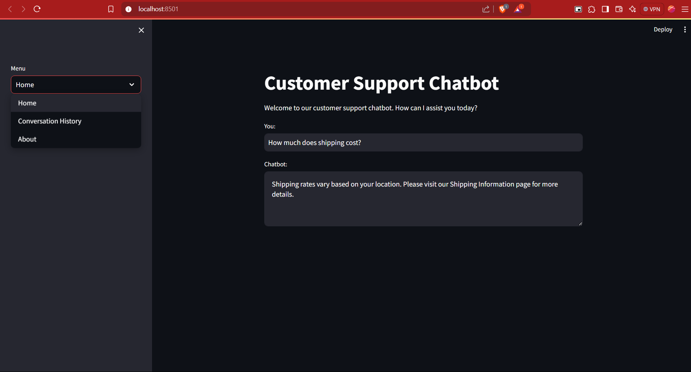
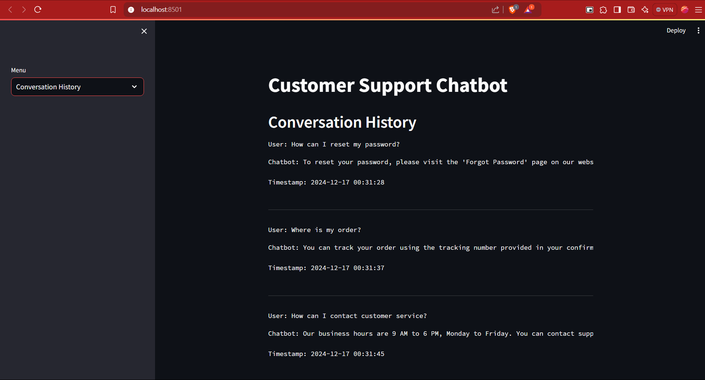

# Customer Support Chatbot

A Customer Support Chatbot built using Natural Language Processing (NLP) techniques and Logistic Regression. The chatbot understands user queries and responds based on predefined intents and their associated responses.

## Project Overview

This project implements a simple customer support chatbot that can classify user input into predefined categories (intents) and generate appropriate responses. The chatbot uses **Logistic Regression** for intent classification and **TF-IDF Vectorization** for text feature extraction. The user interface is built with **Streamlit**, allowing for an interactive web-based experience.






### Key Features:
- **Intent Recognition**: Identifies the intent of the user's input (e.g., greeting, inquiry, complaint).
- **Response Generation**: Provides pre-defined responses based on the identified intent.
- **Conversation History**: Logs user inputs, chatbot responses, and timestamps to a CSV file for later reference.
- **Web Interface**: A Streamlit-based interface to interact with the chatbot.

## Technologies Used

- **Python** 3.x
- **Streamlit**: A framework for building web apps.
- **Scikit-learn**: For implementing machine learning models (Logistic Regression, TF-IDF).
- **NLTK**: For natural language processing tasks (tokenization).
- **Pandas**: For handling CSV-based conversation history.
- **JSON**: For storing predefined intents and responses.

## Requirements

To run this project, you need to install the required dependencies. You can do this by creating a virtual environment and installing the dependencies via `pip`.

1. **Create a Virtual Environment** (optional but recommended):
   ```bash
   python -m venv chatbot-env
   source chatbot-env/bin/activate  # On Windows, use `chatbot-env\Scripts\activate`
2. **Install Dependencies**: 
    Create a requirements.txt file with the following content:
    ```bash
    streamlit
    scikit-learn
    nltk
    pandas

    Then run the following command to install the dependencies:
    ```bash
    pip install -r requirements.txt

## Installation

### 1. Clone the Repository
```bash
git clone <repository-url>
cd <repository-directory>
```

### 2. Create a Virtual Environment (Optional but Recommended)
```bash
python -m venv venv
source venv/bin/activate  # On Windows use `venv\Scripts\activate`
```

### 3. Install Required Packages
```bash
pip install -r requirements.txt
```

### 4. Download NLTK Data
```python
import nltk
nltk.download('punkt')
```

---

## Usage
To run the chatbot application, execute the following command:
```bash
streamlit run app.py
```

Once the application is running, you can interact with the chatbot through the web interface. Type your message in the input box and press Enter to see the chatbot's response.

---

## Intents Data
The chatbot's behavior is defined by the `intents.json` file, which contains various tags, patterns, and responses. You can modify this file to add new intents or change existing ones.

---

## Conversation History
The chatbot saves the conversation history in a CSV file (`chat_log.csv`). You can view past interactions by selecting the "Conversation History" option in the sidebar.

---

## Contributing
Contributions to this project are welcome! If you have suggestions for improvements or features, feel free to open an issue or submit a pull request.

---

## License
This project is licensed under the MIT License. See the [LICENSE](LICENSE) file for details.

---

## Acknowledgments
- **NLTK** for natural language processing.
- **Scikit-learn** for machine learning algorithms.
- **Streamlit** for building the web interface.

---